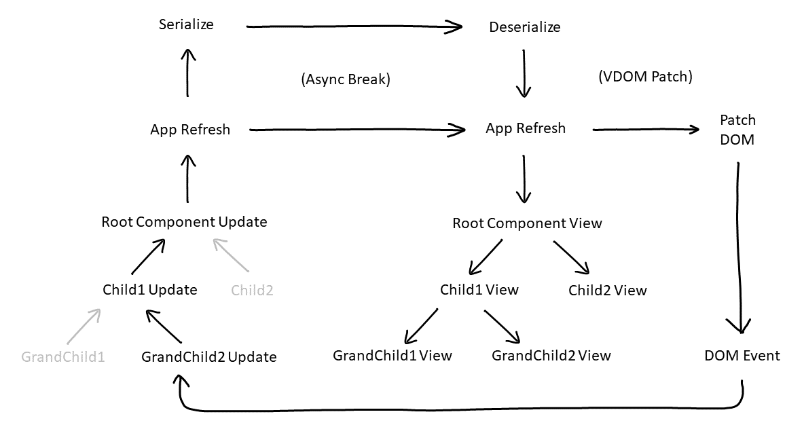

# Why Pickle?

Pickle is the web framework for you if you like:

**No config. No html tags. No css files. Just code.**

Make that **statically typed code**. I.e. **typescript**.

Views use the **functional paradigm**. Views are just functions that return **virtual dom** elements.

Components represent **application state**. They use the **OO paradigm** because the single source of truth should be **tightly coupled** to actions that manage that truth.

**Application state is serializable**. That gives you time travel debugging, hot module reloading, transactions, undo/redo etc.

**Typestyle** integrated by default. Because **programming** is cool.

**Composable**.

**Dry**.

To be more specific:

I think the functional approach should be used for the parts of your application where you can eliminate state, and the OO approach where you need to manage state. Eschewing OO for managing state necessitates concepts like functional lensing, reducers, and higher-order-components, that turn walking into gymnastics. And frequently boilerplate. Conversely, using stateful components to model reusable views polutes that which can be achieved with a pure functional approach. There wasn't a framework where state management and view generation were treated with these distinct but complementary approaches.

In addition, I also found that few of the APIs were written with a static typing mindset. The typescript definitions were an afterthought, meaning that if you want to use static typing, the experience was obviously compromised. In addition, programmers, who are in the business of abstraction, seem strangely infected with "literalus" - the need to *literally* see HTML tags and *literally* work with css. You can elegantly and uniformally express both of those in typescript. Occam's razor demands it.

Finally, pickle is small: see and understand the source code for yourself. Its power comes from its simplicity, and its intended use with many other great libraries:

 * A virtual DOM based on Ultradom (forked)	
 * typestyle (dependency)
 * typescript & reflect-metadata for reflection (dependency)
 * class-tranformer for serialization (dependency)
 * class-validator for validation
 * any animation API using vdom hooks (as in samples)
 * mjackson/history for managing HTML history 
 * any css framework like bootstrap
 * webpack for hot reloading
 * lodash for great utility functions like debouncing used in the samples

# Installation

`npm install pickle-ts`

# Samples

* Live Demos: http://pickle-ts.com/
* Live Editable Code Samples: https://stackblitz.com/@pickle-ts
* Github Samples: https://github.com/pickle-ts/pickle-samples

# Table of Contents

- [Installation](#installation)
- [Samples](#samples)
- [Intro to Pickle](#intro-to-pickle)
- [State, View and Updates](#state--view-and-updates)
- [Composition](#composition)
  * [The @Type Decorator](#the-type-decorator)
- [Component Initialization](#component-initialization)
- [Updates](#updates)
  * [Advanced Updates](#advanced-updates)
- [Views](#views)
  * [Lifecycle Events](#lifecycle-events)
  * [DOM Keys](#dom-keys)    
  * [Animating a List](#animating-a-list)
- [App](#app)
- [Time Travel](#time-travel)
- [Serialization](#serialization)
  * [Circular references](#circular-references)
  * [Keep your component state small](#keep-your-component-state-small)
  * [NaNs](#nans)
- [Hot Module Reloading](#hot-module-reloading)
- [Async](#async)
- [Forms](#forms)
- ['this' Rules](#-this--rules)
- [HTML Helpers](#html-helpers)
- [Style](#style)
- [Task List App](#task-list-app)
- [Beyond Immutability](#beyond-immutability)
- [API Reference](#api-reference)
  * [Component Class API](#component-class-api)
    * [Component View Members](#component-view-members)
    * [Component Initialization Members](#component-initialization-members)
    * [Component Update Members](#component-update-members)
    * [Component Tree Members](#component-tree-members)
  * [App Class API](#app-class-api)
    * [App Initialization Members](#app-initialization-members)
    * [App Serialization Members](#app-serialization-members)
- [Use With...](#use-with)
  * [HTML History](#html-history)
  * [Validation](#validation)

# Intro to Pickle

Let's start with a counter component:

```typescript
export class Counter extends Component
{
    count = 0

    view () {
        return div (
            button ({ onclick : () => this.add (+1) }, "+"),
            this.count,
            button ({ onclick : () => this.add (-1) }, "-")     
        )
    }

    add (x: number) {
        this.update(() => this.count += x) 
    }
}
```
[Play](https://stackblitz.com/edit/pickle-counter)

In pickle, application state lives in your components — in this case `count`.

Components can optionally implement a `view` method, which is a pure non side effecting function of the component's state. Views are rendered with a virtual DOM, such that the real DOM is efficiently patched with only the changes since the last update.

Components update their state exclusively via the their `update` method, which will automatically refresh the view.

# State, View and Updates

A pickle app outputs a virtual DOM node as a pure function of its state. On each update, the previous root virtual DOM node is compared with the new one, and the actual DOM is efficiently patched with the change. DOM events can trigger updates, which result in a view refresh, forming a cyclic relationship between the state and the view.

Components help you factor your app into reusable parts, or parts with separate concerns. An app has a reference to your root component.

Components are designed to be serializable. When autosave or time travel is on, your component tree is serialized on each update. This provides a unified approach to time travel debugging, hot module reloading, transactions, and undo/redo. Serialization is covered in more detail in the serialization section.



This flow diagram represents updating a GrandChild2 component. In this case, we have a very simple application, where the view tree mirrors the component tree. As an application gets larger, the view tree will typically only represent a subset of the component tree. For example, in an application with wizard steps, the component tree would probably have *every* wizard step, while the view tree would only have the *current* wizard step. 

# Composition

Composition is straightforward with `pickle`, allowing you to factor your application into a tree of smaller components:

```typescript
export class TwinCounters extends Component
{
    @Type (() => Counter) counter1 = new Counter ()
    @Type (() => Counter) counter2 = new Counter ()

    view () {
        return div (
            this.counter1.view (),
            this.counter2.view ()
        )
    }
}
```
[Play](https://stackblitz.com/edit/pickle-composition)

Components must have parameterless constructors, though they may include *optional* arguments. This small design restriction enables `class-transformer`'s deserializer to work.

Child components should be created in the constructors, field initialisers, and updates of their parents.

You can specific arrays of components, recursive components, or even arrays of recursive components. Here's from one of the samples:

```typescript
export class Tree extends Component
{    
    @Type (() => Tree) trees: Tree[] = []
    ...
}
```
[Play](https://stackblitz.com/edit/pickle-tree)

## The @Type Decorator

The `@Type` decorator from the `class-transformer` library enables your component classes to be deserialized from plain json objects. It's necessary as **Typescript transpiles away property types** (unlike in C# or Java).

# Component Initialization

You component's life begins with a constructor call. As described later, the deserializer will still call your constructor, but then set the object's properties. That's why your constructor's arguments must be optional.

When your app is first created or deserialized, and after every update, a depth-first traversal occurs, where `attached` is called on every component not already attached:

```typescript
   attached (deserialised: boolean) {
       ...
   }
```
On the traversal, child components are identified by being properties or property array elements of the parent. As such each child will get attached, and have its `parent` and `app` properties set (except the root component which obviously has an undefined `parent`). This enables updates to a child to bubble up to the root component.

# Updates

After app startup or deserialization, all state transitions must occur within an update.

An update is straightforward:

```typescript
    add (x: number) {
        this.update(() => this.count += x) 
    }
```
You pass `update` a void function that performs a state transition.

At the end of an update, the root component's `view` method is called. Updates are synchronous, but views are refreshed asynchronously.

Nested updates are regarded as a single update. The view will at most be called once for an update.

## Advanced Updates

All state changes to `Component` trigger its `updated` method:

```typescript
   updated (payload: any) {
      ...
   }
```
You can also override `beforeUpdate` to prepare for or cancel any update (by returning `false`):

```typescript 
   beforeUpdate (payload: any) {
       // return true to go ahead with update
       // return false to cancel update
   }
```
Both `beforeUpdate` and `updated` are called on an update, from child through the root. This allows a parent to control and respond to updates made by its children, without having to handle specific callbacks.

The `payload` property contains any data associated with the update. The `source` property will be set to component that `update` was called on, that's occasionally useful.

# Views

Views are pure functions of state. Pickle uses a virtual DOM (forked from Ultradom) to efficiently update the actual DOM.

You can add as may optional parameters as you want to your child component `View` methods. This makes it easy for parents to customize their children without their children needing extra state:

```typescript
    view () {
        return div (
            this.child1.view (...),
            this.child2.view (...)
        )
    }
```
`view` methods return the type `VElement`. However, your component might be faceless, having no view implementation, or might have several methods returning different `VElement` objects. This is because pickle components are state-centric, not view-centric.

To write a reusable view, your first approach should be to merely write a function that returns a `VElement`. However, if your view function ends up requiring callbacks to write state back to a component, then you should consider rewriting that view as a component itself, if that component can better encapsulate that state logic.

You may also call `Component.onRefreshed` to queue a callback to perform DOM side effects after the next refresh. You typically do so in the `view` method:

```typescript
   view() {
       this.onRefreshed (() => { ... }) // called after DOM is updated
       return div (...)
   }
```
You may however, need deeper control side-effecting the DOM.

## Lifecycle Events

For the most part, views are pure functions of state. However, DOM elements can have additional state, such as inputs that have focus and selections. Furthermore, animations, at a low level, need to interact with the DOM bypassing the virtual DOM. This is for both performance reasons (as you don't want to invoke the GC), as well as keeping your application state logic separated from your animation state. For example, if you delete an item from a list, it's a simplifying assumption for your application state to consider that item gone, but you'll want that item to live a little longer in the real DOM to gracefully exit.

To interact with the DOM directly, you provide lifecycle callbacks on your virtual DOM elements. The lifecycle callbacks should be familiar to anyone familar with a virtual dom:

```
export interface VLifecycle
{
    onAttached? (el: Element, attrs: VAttributes) : void
    onBeforeUpdate? (el: Element, attrs: VAttributes) : void
    onUpdated? (el: Element, attrs: VAttributes) : void    
    onBeforeRemove? (el: Element) : Promise<void>
    onRemoved? (el: Element) : void
}
```
`onAttached` is called when an element is attached to the DOM.

`onUpdate` is called whenever an element is updated. Use it to perform any final updates to the DOM. The `onBeforeUpdate` lets you take any preliminary actions before the element changes.

`onRemoved` is called when an element is removed from the DOM.`onBeforeRemove` allows you take any preliminary actions - which may be asynchronous - before an element is removed. 

Here's how you might plug in some focusing logic when an element is added to the DOM:

```typescript
 div ({
     onAttached: (el, attrs) => handleFocus (el...)
    ...
```
When the patcher adds an element to the DOM corresponding to your virtual div element, it invokes the `onAttached` callback.

Lifecycle callbacks automatically compose. So both `onAttached` functions will be called here, in the order of appearance:

```typescript
 div (
    {
        onAttached: (el, attrs) => handleFocus (el...)
    },
    {
        onAttached: (el, attrs) => handleSelection (el...)
    }
    ...
 }
```
## DOM Keys

After each update, the virtual DOM is patched. The patcher compares the current virtual DOM tree to the previous one, and modifies the real DOM accordingly. However, the patching algorithm can't know your intent, and so occassionally does the wrong thing. It may try to reuse an element that you definitely want to replace, or it may try to replace a list of child elements that you merely wanted to reorder. To better determine the creation and destruction of DOM nodes, provide *keys* for your virtual DOM nodes. For example:

```typescript
div ({key: wizardPage})
```
If the key changes, the patcher now knows to definitely recreate that DOM element. This means even if your next wizard page happened to have an input that could have been updated, that instead it will be replaced, predictably resetting DOM state like focus and selections, and invoking any animations that should occur on element creation.

## Animating a List

Let's combine the concepts in the previous sections to shuffle an array, where each element gracefully moves to its new position each time the array is updated. We can use lodash's shuffle function to perform the `shuffle`, and our own `slideChildren` function to perform the animation. We'll need to make sure each item in the array has a unique `key`, so that the patcher knows to reuse each child element.

```typescript
export class AnimateListExample extends Component
{
    @Exclude() items = range (1, 20)

    view () {        
        return div(
            myButton (() => this.shuffle (), "shuffle"),       
            ul (slideChildren(), this.items.map (n => li ({ key: n }, n)))
        )
    }

    shuffle() {
        this.update (() => this.items = shuffle (this.items))
    }
}
```
We can implement `slideChildren` using the [FLIP](https://aerotwist.com/blog/flip-your-animations/) technique:
```typescript
export function slideChildren () : VLifecycle
{
    return {                       
        onBeforeUpdate (el) {                
            let els = el["state_slideChildren"] = Array.from(el.childNodes).map(c => (c as HTMLElement))
            els.forEach (c => measure(c))
        },
        onUpdated (el) {
            if (create)
               return

            let els = el["state_slideChildren"] as HTMLElement[]
            els.forEach (c => flip (c))
        }                    
    } 
}
```
[Play](https://stackblitz.com/edit/pickle-animating-a-list)

By design, these lifecycle events are not present on pickle components. Pickle components manage application state, only affecting DOM state via its `view` method, and the intentionally ungranular `onRefreshed` method. This lets you separate the very different lifecycles of application state and DOM state, making your code easier to maintain.

While there's always pragmatic exceptions, the principles of pickle state are:

 * Application state belongs on components.
 * DOM state belongs on DOM elements.
 * No state belongs on virtual DOM elements.

# App

To start Pickle, pass the constructor of your top level component into your App instance, with a string defining the id of the element where you app will be hosted. You must also import `reflect-metadata` before any of your classes are loaded. For example:

```typescript
import 'reflect-metadata'
import { App } from 'pickle-ts'

var app = new App (Counter, "app")
```

You can access the app's `time` property to perform time travel.

You can also construct your app to automatically save to local storage on each update, as explained in the serialization section.

# Time Travel

Maintaining state history is useful when you want transactions, undo/redo, and time travel debugging.

You can turn time travel on and off through the time object on App:

```typescript
app.timeTravelOn = true|false
```
Now all updates will be recorded.

You can now navigate as follows:

```typescript
time.start()  // goto start state
time.end()    // goto end state
time.next()   // goto next state
time.prev()   // goto prev state
time.goto(4)  // goto nth state
```
You can also use a predicate to seek a particular state:
```typescript
time.seek(state => state.counter.count == 7)
```

When time travel is on, pickle serializes the component tree on each update. It's efficient and mostly transparent, but make sure to read the serialization section.

# Serialization

It's useful to be able to serialize your application to local storage. This means users can refresh without losing their data, which is also great during development.

To save our application with each update, we set the app `autosave` property on the app's `storage` object to `true`:

```typescript
app.storage.autosave = true
```
This will save your serialized component tree in local storage with the container id you specified (e.g `"app"`).

To turn `autosave` off and clear your application state from local storage:
```typescript
app.storage.autosave = false
app.storage.clear()
```

Pickle uses the `class-transformer` npm package to serialize and deserialize your component classes. Nested components need to be decorated as follows to deserialize correctly:

```typescript
import { Type } from 'class-transformer'

class MyParent extends Component {
   @Type (() => MyChild) child: MyChild
```

As mentioned previously, that's a little bit of boilerplate but Typescript needs that type information.

When deserializing, as a result of time travel or loading from local storage, your constructors will execute, and then your component's fields will be set.

There's a couple of points to be aware of:

## Circular references

Avoid circular references unless you absolutely need them. Firstly, the serializer doesn't handle them, and secondly, it increases your cyclomatic complexity which is why some languages like F# deliberately force you to minimize them. However, occassionaly you'll need them. To do so:

* override component's `attached` method to set the circular references there
* exclude the circular references from being serialized with the `@Exclude()` decorator

## Keep your component state small

As a general rule, don't gratuitously use component state, and instead try to use pure functions where you can. In particular, avoid storing UI styles in component state - instead pass styles from a parent view down to child views. If you must store a UI style in a component, you'll probably want to decorate it with `@Exclude` to avoid serialization.

Serialization, deserialization, and local storage are surpisingly fast. However, efficiency is still important. Avoid properties with large immutable objects, and instead indirectly reference them with a key. For example, instead of directly storing a localisation table of French data on your component, you'd merely store the string "fr", and return the localisation table based on that key. Minimize the state on your components to that which you need to respond to user actions; keep it as close to a state machine as possible.

## NaNs

Unfortunately, for now `class-transformer` converts `NaN` to `null` values. On deserialization, convert them back. This is a small outstanding issue.
```
attached (deserialised: boolean) {
    this.foo = this == null ? NaN : foo
}
```

# Hot Module Reloading

When your application state is serialized, an ordinary page refresh will run your modified code with your previous state. We can automatically trigger a page refresh by listening to server code changes:

```typescript
module.hot.accept('../app/samples', () => { location.reload() })

```
# Async

Pickle's update path is synchronous, so you perform aynchronous activites outside of update. Suppose a button invokes your submit event handler that calls a web service. That could be defined as follows: 

```typescript
    async submit () {
        var result = await fetch(url)
        if (result.ok) {
            this.update (() => ...)
        }
    }
```
Notice that the `update` occurs *after* the asynchronous operation has completed.

Note that the samples demonstrate calling github's search, with debouncing.

# Forms

To make writing forms easier, pickle provides some widget functions for common inputs, and provides an `updateProperty` callback for updating properties in the `Component`. In this example, we write a BMI component with two sliders:

```typescript
export class BMI extends Component
{
    height = 180
    weight = 80

    calc () {
        return this.weight / (this.height * this.height / 10000)
    }

    view () {       
        return div (             
            div (
                "height",
                slider (() => this.height, 100, 250, 1, e => this.updateProperty (e)),
                this.height
            ),
            div (
                "weight",
                slider (() => this.weight, 30, 150, 1, e => this.updateProperty (e)),
                this.weight
            ),
            div ("bmi: " + this.calc())
        )
    }
}
```
[Play](https://stackblitz.com/edit/pickle-bmi)

The `updateProperty` callback takes a `KeyValue` argument, which has a key and value that map to the Component property name and new value. `updateProperty` calls through to the component's `update` for you.

**Always initialise component fields explicitly, and for numbers use NaN rather than undefined**. This is because **Typescript transpiles away property types**, meaning that at runtime pickle can't know whether it's dealing with a string or number, and assumes an undefined value is a string by default, in the absence of a runtime value.

# 'this' Rules

The `this` variable's binding is not as straightforward as in object oriented languages like C# and Java. There's a great article about [this here](https://github.com/Microsoft/TypeScript/wiki/'this'-in-TypeScript).

Within pickle components, follow the pattern you see in this documentation, which has two rules:

Always wrap a method that's used as a callback in a closure, otherwise `this` might be lost before it's bound.

```typescript
    // RIGHT
    methodUsingYourCallback (e => this.updateProperty (e))
    
    // WRONG
    methodUsingYourCallback (this.updateProperty)
```
Use ordinary class methods, not function members when calling update. Otherwise cloning — which pickle relies on for time travel — fails, since the cloned function will refer to the old object's this.

```typescript
    // RIGHT
    add () {
       return this.update (...

    // WRONG
    add = () =>
        this.update (...
```
# HTML Helpers

The HTML helpers take a spread of attribute objects, elements, and primitive values. Pickle has been designed to work well with Typescript, so your IDE can provide statement completion. In conjunction with `typestyle`, as we'll see later, we get a deep, clean static typing experience.

Attribute objects go first. Some examples:

```typescript
div ()                                  // empty
div ("hello")                           // primitive value
div ({id: 1})                           // attribute
div ({id: 1, class: "foo"})             // multiple attributes
div ({id: 1}, "hello")                  // attribute followed by element
div (div ())                            // nested elements
div ({id: 1}, "hello", div("goodbye"))  // combination
```
Multiple attribute objects are merged. Merging attributes is really useful when writing functions allowing the caller to merge their own attributes in with yours. The following are equivalent:

```typescript
div ({id: 1}, {class:"foo"})
div ({id: 1, class:"foo"})  
```
Event handlers are specified as simply a name followed by the handler:
```
button (
    { onclick : () => this.add (1) }, "+"
)
```

# Style

Pickle accepts [typestyle](https://github.com/typestyle/typestyle) objects for style attributes, letting you write css in typescript. This enables you to abstract and organize your styles with typescript. This lets you express styles in a language (i.e. typescript) that's far more powerful than any stylesheet language, and eliminates the seam between your view funtions and styles. The last point makes it trivial to colocate your code with your styles, or provide exactly the appropriate level of coupling to maximise maintainability.

```typescript
div ({style: {color:'green' }}, 'pickle')
```
Pickle will call typestyle's `style` function on the object you provide. It's as if you called:

```typescript
div ({class: style ({color:'green'})}, 'pickle')
```
If you need to reuse a style, then don't inline the style: declare it as a variable and refer to it in your class attribute. You can factor it just as you please.

Typestyle will dynamically create a small unique class name, and add css to the top of your page. So the following:

```typescript
div ({style: {color: 'green'} },
    "pickle"
)
```
Which will generate something like:

```html
<div class="fdwf33">
    pickle
</div>
```
With the following css:
```css
fdwf33 {
    style: green;
}
```
Pickle automatically combines css values. The following are equivalent:

```typescript
div ({class: "big"}, {class: "happy"})
div ({class: "big happy"})
```

You may also use ordinary style strings, which bypasses the typestyle library.

# Task List App
It's common for client-side web frameworks to demonstrate how they'd write a task app. Here's how you write one in pickle:

```typescript
export class Todos extends Component
{    
    currentText: string
    list: string[] = []

    add () {
        this.update(() => {            
            this.list = this.list.concat (this.currentText!)
            this.currentText = undefined
        })
    }

    delete (task: string) {
        this.update (() =>
            this.list = this.list.filter (t => t != task)
        )
    }

    view () {
        return div (
            inputText (() => this.currentText, e => this.updateProperty (e)),
            ! this.currentText ? undefined : commandButton (() => this.add(), 'Add'),
            ul (
                this.list.map (task =>
                    li (
                        task,
                        commandButton (() => this.delete (task), "delete")
                    )
                )
            )
        )
    }
}
```
That's the essence of it. However, a more complete example is here: [Play](https://stackblitz.com/edit/pickle-task-list)

Keep things simple! Only write components if they need to manage their own state. In this case, we didn't need a sub component for an individual task.

# Beyond Immutability

Pickle's update model is inspired by transactional memory. The idea is we optimistically mutate the current state, but when we want to, we can time travel back to an old state. This gives us the core benefits of immutability, but with a natural programming model. So an ordinary property update is simply:

```typescript
state.prop++
```
rather than with the immutable pattern:

```typescript
var newState = { ...state, prop: state.prop + 1 }
```
and for nested updates:

```typescript
root.child1.child2.prop++
```
Which with immutability, requires tactics such as functional lensing, otherwise you'd have to go:

```typescript
var newRoot =
    { ...root, child1:
        { ...root.child1, child2:
            { ...root.child1.child2, prop: root.child1.child2.prop + 1 }
        } 
    }
``` 

The other benefit of the transactional memory approach, is we can also have asynchronous methods that optimistically update `this` when continuing. Note that when we time travel, our `this` in that scenario is of course lost.

# API Reference

The `Component` and `App` APIs have been covered in earlier sections, and can also be understood through intellisense and the source code, but are included here to give a reference-oriented overview.

The HTML, lifecycle, serialization, and time travel APIs have already been covered in their dedicated sections.

## Component Class API

### Component View Members

```typescript
/** Override to return a virtual DOM element that visually represents the component's state */
view(): VElement

/** Call to run an action after the view is rendered. Think of it like setTimeout but executed at exactly at the right time in the update cycle. */
onRefreshed (action: () => void) 
```

### Component Initialization Members

```typescript
/** Called after construction, with a flag indicating if deserialization occured */
attached (deserialized: boolean) 
```
### Component Update Members

```typescript
/** Call with action that updates the component's state, with optional payload */
update (updater: () => void, payload: any = {}) 

/** Override to capture an update before it occurs, returning `false` to cancel the update
* @param payload Contains data associated with update - the update method will set the source property to 'this'
*/
beforeUpdate (payload: any) : boolean

/** Override to listen to an update after its occured
* @param payload Contains data associated with update - the update method will set the source property to 'this'
*/
updated (payload: any) : void

/** A convenient shortcut to update a component property; wraps property change in update */
updateProperty (payload: KeyValue)
```

### Component Tree Members

```typescript
/** The app associated with the component; undefined if not yet attached - use judiciously - main purpose is internal use by update method */
app?: App

/** The parent component; undefined if the root component - use judiciously - main purpose is internal use by update method */
parent?: Component  

/** Returns the root component by recursively walking through each parent */
root () : Component 

/** Returns the branch, inclusively from this component to the root component */
branch () : Component[]

/** Returns the properties that are components, flattening out array properties of components */
children () : Component[]      
```
## App Class API

### App Initialization Members
```typescript
/**    
 * The entry point for a pickle app
 * @param rootComponentConstructor The parameterless constructor of the root component
 * @param containerId The element id to render the view, and local storage name
 */
constructor (rootComponentConstructor: new () => Component, containerId: string)

/** Root component of updates, view and serialization */
rootComponent: Component 
```

### App Serialization Members
```typescript
/** Manages serialization of root component to local storage */
storage: Storage 

/** manages time travel - type is 'any' because component snapshots are converted to plain json objects */
time: TimeTravel<any> 

/** whether snapshots occur by default after each update */
timeTravelOn: boolean 

/**
 * Serialize the root component to local storage and/or time travel history
 * @param doSave true = force save, false = do not save, undefined = use value of App.storage.autosave
 * @param doTimeSnapshot true = force snapshot,false = do not snapshot, undefined = use value of App.timeTravelOn
 */
snapshot(doSave?: boolean, doTimeSnapshot?: boolean): void
```

# Use With...

These libraries weren't mentioned, but are very useful:

## HTML History
https://github.com/ReactTraining/history

The sample app demonstrates integrating history to provide routing. At its heart, routing is about mapping the path of a url to component state. By responding to history changes, you can set the state which will in turn render the correct view. Often the state in these cases is the name of the component or sub-component that should be rendered at the exclusion of its sibling components.

## Validation
https://github.com/typestack/class-validator

You'll want to sprinkle your component's properties with validate decorators.